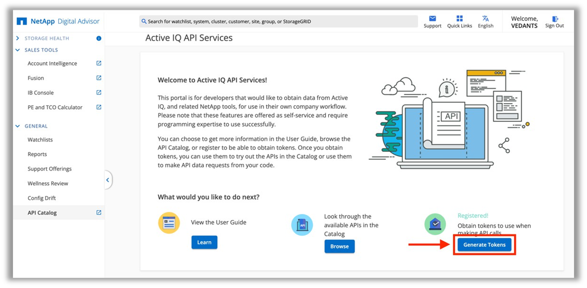
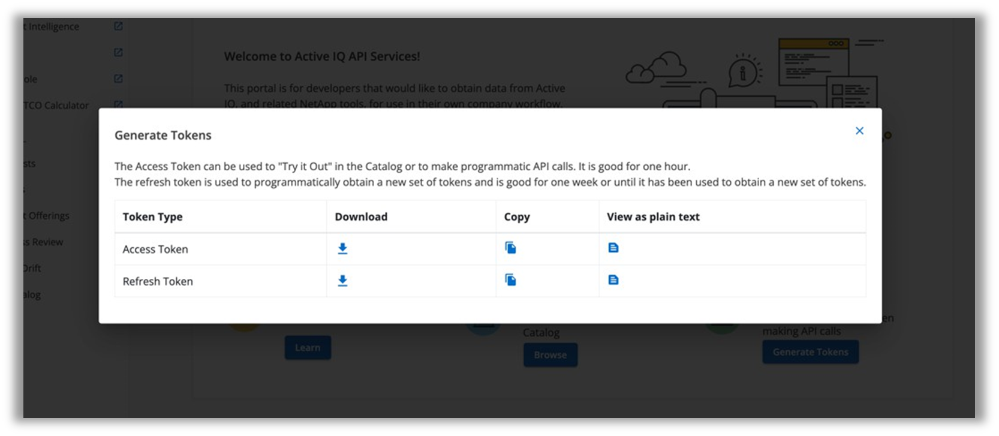

= Generate refresh and access tokens
:hardbreaks:
:nofooter:
:icons: font
:linkattrs:
:imagesdir: ../media/

[.lead]
A refresh token is used to programmatically obtain a new set of access tokens and is good for one week or until it has been used to obtain a new set of tokens.

Steps to generate a refresh token using the AIQ Digital Advisor portal are as follows:

. Log in to the https://aiq.netapp.com/api[*AIQ portal*] (https://aiq.netapp.com/api) using NetApp credentials  and click on *Generate Tokens*.
+

+
NOTE: For first-time users, if *Generate Tokens* option is not available, click on *Register* to submit an authorization request. Fill out the registration form to enable the functionality.
+
. AIQ will generate an access token and a refresh token. Save the *refresh token* on a trusted platform.

== Generate access token
The access token is used to authenticate AIQ Digital Advisor API requests. It can be generated directly through the console along with the refresh token or using the following API call:

*Request:*
[width="100%",cols="41%,59%",]
|===
|*Method* |POST
|*Endpoint* |https://api.activeiq.netapp.com/v1/tokens/accessToken
|*Headers* a|
. accept: application/json
. Content-Type: application/json

|*Request Body* a|
{
"refresh_token": "<refresh-token>"
}

|===

NOTE: Access to this API needs administrative privileges for AIQ Digital Advisor.

*Response:*

API returns an access token and a refresh token in a JSON format as response.
----
{
"refresh_token": "string",
"access_token": "string"
}
----
*Status code*: 200 – Successful request

*Curl command*:
----
curl -X 'POST' \ 'https://api.activeiq.netapp.com/v1/tokens/accessToken' \ -H 'accept: application/json' \ -H 'Content-Type: application/json' \ -d ' { "refresh_token": "<refresh-token>" }'
----

== Execute the API call

Upon successful generation of access token, authorized ActiveIQ Digital Advisor API calls can be executed for required information.